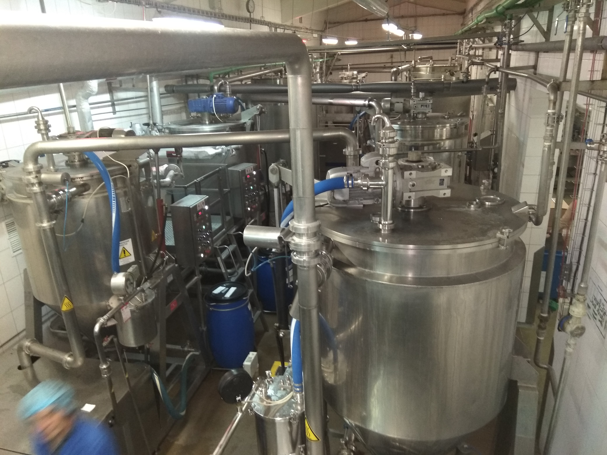
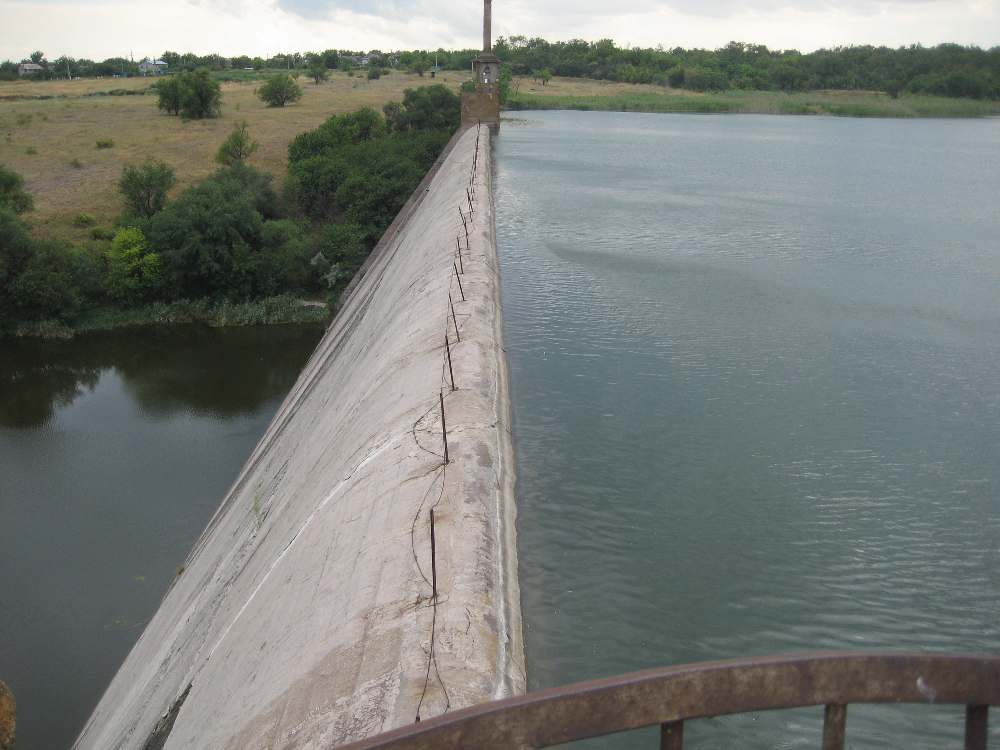
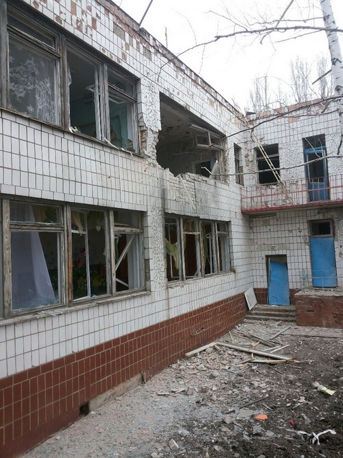
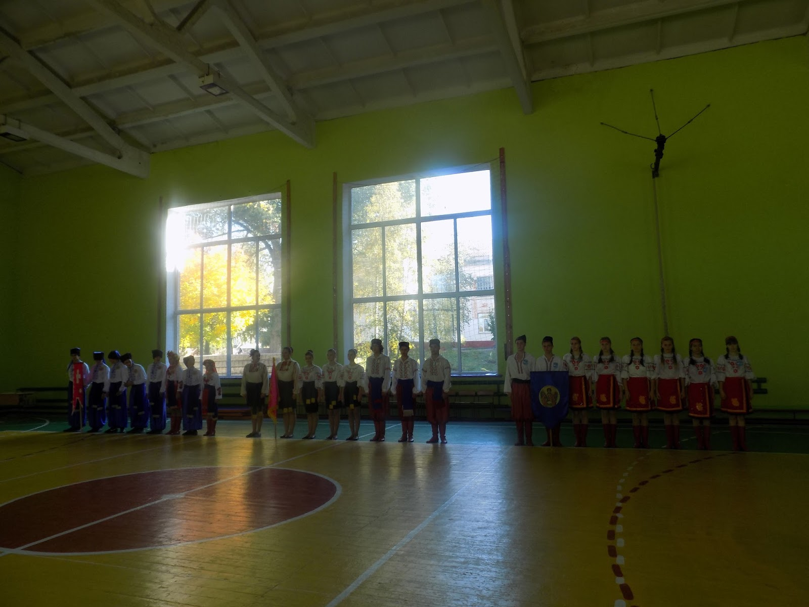
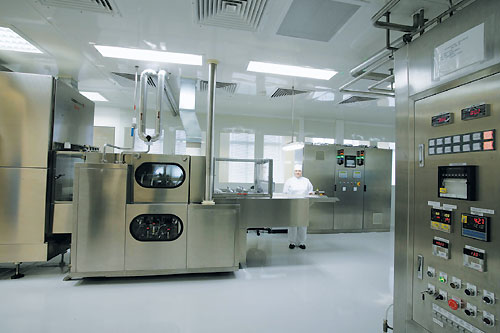
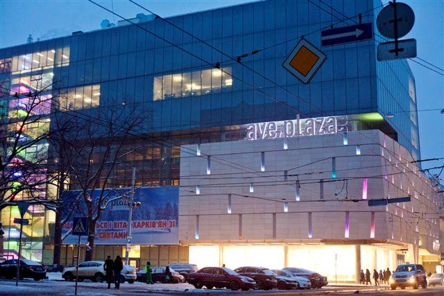
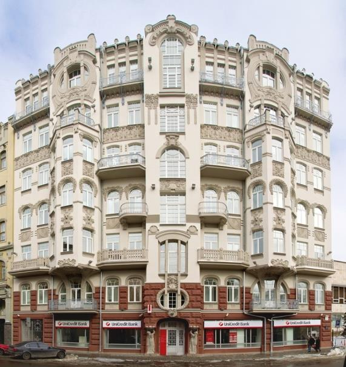
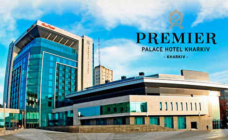
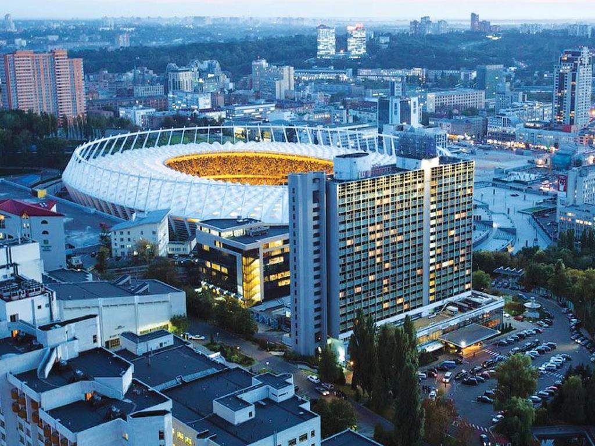
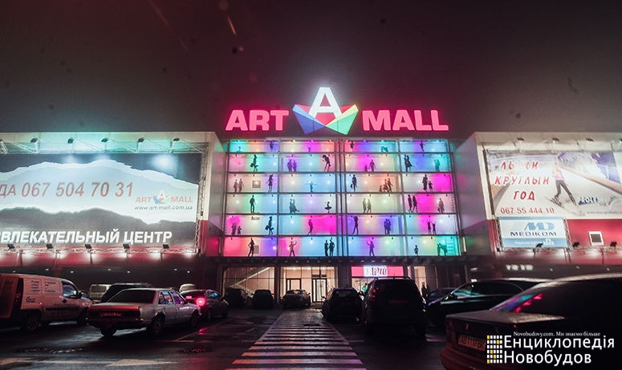

<!DOCTYPE html>
<html lang="en">
<head>
<meta charset="utf-8">
  <title>Construction, engineering and survay servises</title>      
  
 </head>
<body>
    
   <h1 id="rev" style="text-align: center;">Denys Babenko│Technical Project Manager</h1>
    
    
Location: Kyiv, Ukraine

    
Telephone: + 38 063 993 4728

    
Email: d_babenko@ukr.net

    
Site: d_babenko@ukr.net

    
    <h2 style="text-align: center;">Professional Profile</h2>
    
    
‘Professional Project Manager with fifteen years of experience in the Construction and Engineering, with successful track record in design-construct-install-commissioning in infrastructure and industrial projects’.

    
Successful implementation of multi-tasking projects (commercial, warehouses, hotels, infrastructure...) (budget: 1-10 million $) allows me to confidently plan and implement complex projects from the stage of design, construction, installation to commissioning. My projects bring the Customer high payback, low risks and allow strengthening their market share. Detailed preliminary planning and precise implementation allow our Project Team to progressive and predictably achieve its goals.

    
    <h2 style="text-align: center;">Core Skills</h2>
    <table  width="700">
<tbody>
<td width="350">
<ul>
<li>Construction background</li>
<li>Capital Investment planning</li>
<li>AutoCAD and MS Project proficient, SAP</li>
<li>Experience with all Engineering systems</li>
</ul>
</td>
<td width="350">
<ul>
<li>Purchasing process leading</li>
<li>Critical thinking</li>
<li>English, Russian, Ukrainian</li>
<li>Driver's license</li>
</ul>
</td>
</tbody>
</table>
    
    <h2 style="text-align: center;">Career Summary</h2>
    
&nbsp;

<strong>Jul 2017 &ndash; Present</strong> &nbsp;&nbsp;&nbsp;&nbsp;&nbsp;&nbsp;&nbsp;&nbsp;&nbsp;&nbsp;&nbsp;&nbsp;&nbsp;&nbsp;&nbsp;&nbsp;<strong>Nestle, Ukraine </strong>

&nbsp;&nbsp;&nbsp;&nbsp;&nbsp;&nbsp;&nbsp;&nbsp;&nbsp;&nbsp;&nbsp;&nbsp;&nbsp;&nbsp;&nbsp;&nbsp;&nbsp;&nbsp;&nbsp;&nbsp;&nbsp;&nbsp;&nbsp;&nbsp;&nbsp;&nbsp;&nbsp;&nbsp;&nbsp;&nbsp;&nbsp;&nbsp;&nbsp;&nbsp; &nbsp;&nbsp;&nbsp;&nbsp;&nbsp; &nbsp;&nbsp;&nbsp;&nbsp;&nbsp;&nbsp;&nbsp;<strong>Project Manager</strong>

    
<em>Outline</em>

I plan, approve and implement major (2-5 m $) company projects at production sites (production, logistic, construction, engineering)

    
<em>Key responsibilities</em>

    <ul>
        <li>Organization of work on main projects (new workshop construction, warehouse…)</li>
        <li>Creation and management of the project team, risks, timing and resources</li>
        <li>Analysis and choose of the main engineering and organizational solutions</li>
        <li>Implementation and monitoring of the selected projects</li>
        <li>Supply and launch of the main equipment, automation</li>
        <li>Quality and SHE control during the implementation phase</li> 
</ul>
    
<em>Key achievements</em>

    <ul>
        <li>Launched the project: Production of new Ketchup (new technology, equipment and construction) within the budget and with minimal downtime. The product is successful on the market</li>
        <li>Realized the project: Construction of a new modern warehouse-DC for Nestle products</li>
    </ul>
    
    
    
    
&nbsp;

<strong>Jul 2016 &ndash; May 2017</strong> &nbsp;&nbsp;&nbsp;&nbsp;&nbsp;&nbsp;&nbsp;&nbsp;&nbsp;&nbsp;&nbsp;&nbsp;&nbsp;&nbsp;&nbsp;&nbsp;<strong>UNICEF, Ukraine </strong>

&nbsp;&nbsp;&nbsp;&nbsp;&nbsp;&nbsp;&nbsp;&nbsp;&nbsp;&nbsp;&nbsp;&nbsp;&nbsp;&nbsp;&nbsp;&nbsp;&nbsp;&nbsp;&nbsp;&nbsp;&nbsp;&nbsp;&nbsp;&nbsp;&nbsp;&nbsp;&nbsp;&nbsp;&nbsp;&nbsp;&nbsp;&nbsp;&nbsp;&nbsp;&nbsp;&nbsp;&nbsp;&nbsp;&nbsp;&nbsp;&nbsp;&nbsp;&nbsp;&nbsp;&nbsp;&nbsp;&nbsp;&nbsp;&nbsp;&nbsp;&nbsp;<strong>WASH Officer (Infrastructure in water and sewage)</strong>

    
<em>Key responsibilities</em>

    <ul>
        <li>Preparation of a strategy for the implementation of projects and agreed with the Customer</li>
        <li>Organizes work on capital investments business plan compilation with a complete assessment</li>
        <li>Implementation and monitoring of the work on important infrastructure(main pumping stations, pipelines, city networks)</li>
</ul>
    
<em>Key achievements</em>

    <ul>
        <li>Realization of 6 m Euro projects in time and with the set goals. Realized projects on modernization of water supply and sewage systems in the Mariupol region (water loss is reduced by 25%, electricity consumption reduced by 15%)</li>
        <li>Improved system reliability and extended lifetime</li>
    </ul>
    
    
    
    
      
&nbsp;

<strong>Oct 2015 &ndash; Jun 2016</strong> &nbsp;&nbsp;&nbsp;&nbsp;&nbsp;&nbsp;&nbsp;&nbsp;&nbsp;&nbsp;&nbsp;&nbsp;&nbsp;&nbsp;&nbsp;&nbsp;<strong>UNICEF, Ukraine </strong>

&nbsp;&nbsp;&nbsp;&nbsp;&nbsp;&nbsp;&nbsp;&nbsp;&nbsp;&nbsp;&nbsp;&nbsp;&nbsp;&nbsp;&nbsp;&nbsp;&nbsp;&nbsp;&nbsp;&nbsp;&nbsp;&nbsp;&nbsp;&nbsp;&nbsp;&nbsp;&nbsp;&nbsp;&nbsp;&nbsp;&nbsp;&nbsp;&nbsp;&nbsp; &nbsp;&nbsp;&nbsp;&nbsp;&nbsp; &nbsp;&nbsp;&nbsp;&nbsp;&nbsp;&nbsp;&nbsp;<strong>Construction engineer (Rehabilitation of 35 schools)</strong>

    
<em>Key responsibilities</em>

    <ul>
        <li>Rehabilitation of 35 Schools in Luhansk and Donetsk Oblasts</li>
        <li>I assessed and prepared recommendations for schools (renovation of toilets, providing schools with storage tanks for water, reconstruction of water supply, sewerage and heating)</li>
        <li>Prepare and drive tender procedures for rehabilitation works</li>
        <li>Monitoring of contractors for repair of schools</li>
</ul>
    
<em>Key achievements</em>

    <ul>
        <li>Complex modernization of  35 schools in short period</li>
        <li>Implemented new energy saving and effective measures</li>
    </ul>
    
    
    
    
        
&nbsp;

<strong>Oct 2012 &ndash; Oct 2015 &nbsp;&nbsp;&nbsp;&nbsp;&nbsp;&nbsp;&nbsp;&nbsp;&nbsp;&nbsp;&nbsp;&nbsp;&nbsp;&nbsp;&nbsp;&nbsp;&nbsp;&nbsp;&nbsp;&nbsp;&nbsp;&nbsp;&nbsp; &nbsp;</strong><strong>Pharmaceutical corporation &ldquo;Arterium&rdquo;, Ukraine</strong>

&nbsp;&nbsp;&nbsp;&nbsp;&nbsp;&nbsp;&nbsp;&nbsp;&nbsp;&nbsp;&nbsp; &nbsp;&nbsp;&nbsp;&nbsp;&nbsp;&nbsp;&nbsp;&nbsp;&nbsp;&nbsp;&nbsp;&nbsp;&nbsp;&nbsp;&nbsp;&nbsp;&nbsp;&nbsp;&nbsp;&nbsp;&nbsp;&nbsp;&nbsp;&nbsp;&nbsp;&nbsp;&nbsp;&nbsp;&nbsp;&nbsp;&nbsp;&nbsp;&nbsp;&nbsp;&nbsp;&nbsp;&nbsp;&nbsp;&nbsp;&nbsp;&nbsp;&nbsp;&nbsp;&nbsp;&nbsp;&nbsp;&nbsp;&nbsp;<strong>Project Manager</strong>

     
<em>Outline</em>

Modernization, reconstruction of capacities of two plants "Kiyevmedpreparat" and "Galychfarm" (production, research, and engineering)

    
<em>Key responsibilities</em>

    <ul>
        <li>Implementation of projects of complex reconstruction of production and resulting to GMP conditions; - realization</li>
        <li>Construction of the new Research center of corporation</li>
        <li>Optimization of work of sites of packing, tablet shops, shops of injection forms</li>
        <li>Creation and development of project management department</li>
</ul>
    
<em>Key achievements</em>

    <ul>
        <li>Reconstructed of tablet shop with the replacement of equipment. Relevance - GMP, a new broad product line, resource optimization</li>
        <li>Built and launched a new research center of the company</li>
    </ul>
    
    
    
    
<strong>Oct 2010 &ndash; Oct 2012 &nbsp;&nbsp;&nbsp;&nbsp;&nbsp;&nbsp;&nbsp;&nbsp;&nbsp;&nbsp;&nbsp; </strong>&nbsp;&nbsp;&nbsp;&nbsp;&nbsp;&nbsp;&nbsp;&nbsp;&nbsp;&nbsp;&nbsp;&nbsp;&nbsp;<strong>Rustler Property Service, Ukraine </strong>

&nbsp;&nbsp;&nbsp;&nbsp;&nbsp;&nbsp;&nbsp;&nbsp;&nbsp;&nbsp;&nbsp;&nbsp;&nbsp;&nbsp;&nbsp;&nbsp;&nbsp;&nbsp;&nbsp;&nbsp;&nbsp;&nbsp;&nbsp;&nbsp;&nbsp;&nbsp;&nbsp;&nbsp;&nbsp;&nbsp;&nbsp;&nbsp;&nbsp;&nbsp;&nbsp;&nbsp;&nbsp;&nbsp;&nbsp;&nbsp;&nbsp;&nbsp;&nbsp;&nbsp;&nbsp;&nbsp;&nbsp;&nbsp;&nbsp;&nbsp;&nbsp;&nbsp;&nbsp;&nbsp;&nbsp;&nbsp;&nbsp;&nbsp;&nbsp; <strong>Project manager</strong>

     
<em>Outline</em>

Facility and property management, operation and maintenance of objects and engineering systems, engineering and assessment of a technical condition of buildings and systems

    
<em>Key achievements</em>

    <ul>
        <li>Realized reconstruction and capital repair projects with: BC "Valmi" (SWEDBANK), "Ave Plaza"(UNIQA), UniCredit Bank, Colliers Ukraine, Austrian Embassy</li>
    </ul>
    
    
    
    
<strong>Jan 2008 &ndash; Feb 2010 &nbsp;&nbsp;&nbsp;&nbsp;&nbsp;&nbsp;&nbsp;&nbsp;&nbsp;&nbsp;&nbsp; &nbsp;&nbsp;&nbsp;&nbsp;&nbsp;&nbsp;&nbsp;&nbsp;&nbsp;&nbsp;&nbsp;&nbsp;&nbsp;Hotel &lsquo;Premier Palace&rsquo;, 5* Kyiv</strong>

<strong>&nbsp;&nbsp;&nbsp;&nbsp;&nbsp;&nbsp;&nbsp;&nbsp;&nbsp;&nbsp;&nbsp;&nbsp;&nbsp;&nbsp;&nbsp;&nbsp;&nbsp;&nbsp;&nbsp;&nbsp;&nbsp;&nbsp;&nbsp;&nbsp;&nbsp;&nbsp;&nbsp;&nbsp;&nbsp;&nbsp;&nbsp;&nbsp;&nbsp;&nbsp; &nbsp;&nbsp;&nbsp;&nbsp;&nbsp;&nbsp;&nbsp;&nbsp;&nbsp;&nbsp;&nbsp;&nbsp;&nbsp;&nbsp;&nbsp;&nbsp;&nbsp;&nbsp;&nbsp;&nbsp;&nbsp;&nbsp;&nbsp;&nbsp; Leading engineer of construction and reconstruction</strong>

    
<em>Key achievements</em>

    <ul>
        <li>Launched new 5* hotel “Harkiv Palace” (Hilton standards)</li>
        <li>Complex repairing 2 floors room “Rus” 3* hotel for Euro 2012</li>
    </ul>
    
    
    
    
<strong>Mar 2006 &ndash; Jan 2008 &nbsp;&nbsp;&nbsp;&nbsp;&nbsp;&nbsp;&nbsp;&nbsp;&nbsp;&nbsp;&nbsp;Alacor-Immoeast AG, Kyiv</strong>

<strong>&nbsp;&nbsp;&nbsp;&nbsp;&nbsp;&nbsp;&nbsp;&nbsp;&nbsp;&nbsp;&nbsp;&nbsp;&nbsp;&nbsp;&nbsp;&nbsp;&nbsp;&nbsp;&nbsp;&nbsp;&nbsp;&nbsp;&nbsp;&nbsp;&nbsp;&nbsp;&nbsp;&nbsp;&nbsp;&nbsp;&nbsp;&nbsp;&nbsp;&nbsp; &nbsp;&nbsp;&nbsp;&nbsp;&nbsp;&nbsp;&nbsp;&nbsp;&nbsp;&nbsp;&nbsp; Project manager</strong>

    
Realized the green-field development project. From landing to commissioning: http://artmall.ua/

   
    
    
    
<h2 style="text-align: center;">Education & Qualifications</h2>
    
     <ul>
    <li><a target="_blank" href="http://nung.edu.ua/en/department/ipe-0">Mechanical engineer in Construction, designing, and exploitation of oil- and gas pipelines and storage tanks, Master degree–Iv-Frankivsk State Technical University of Oil and Gas, 1999	Mechanical engineer in Construction, designing, and exploitation of oil- and gas pipelines and storage tanks, Master degree–Iv-Frankivsk State Technical University of Oil and Gas, 1999</a></li>
    <li><a target="_blank" href="http://www.iot.kiev.ua/index.php?lang=en">Certified design-Engineer, Institute of Oil Transportation, Kyiv, 1999 </a></li>
    <li><a target="_blank" href="http://www.saipem.com/sites/SAIPEM_en_IT/home/saipem-homepage.page">Health, Safety, Environment in project and construction works, Certified specialist grade – SAIPEM” ENI Group Romania, Bucharest - 2003 </a></li>
    <li><a target="_blank" href="http://www.arterium.ua/en"> PMP program - Arterium training Center – 2012 </a></li>
    </ul>
    
    <h2 style="text-align: center;">References Available on Request</h2>
    <a href="#rev">Go to Contacts</a>
    </body>
</html>
